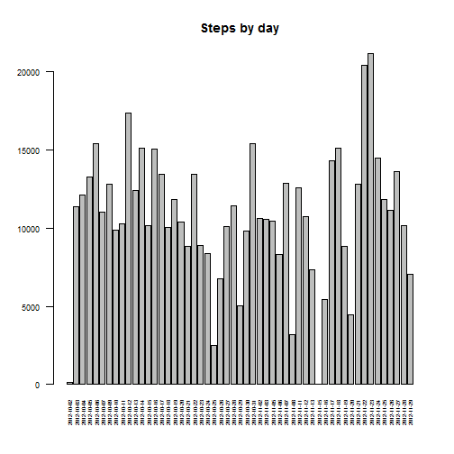
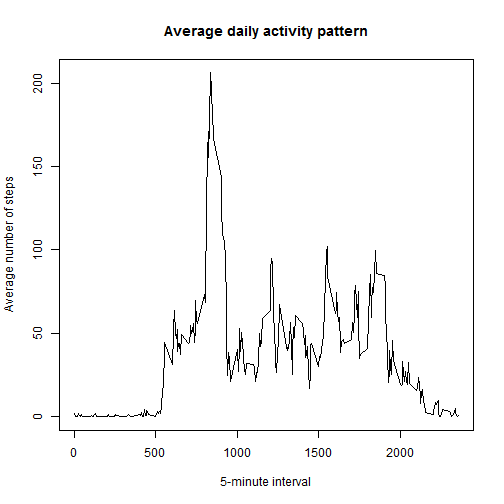
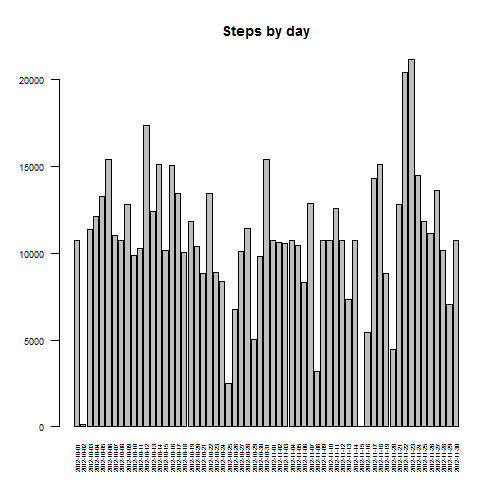
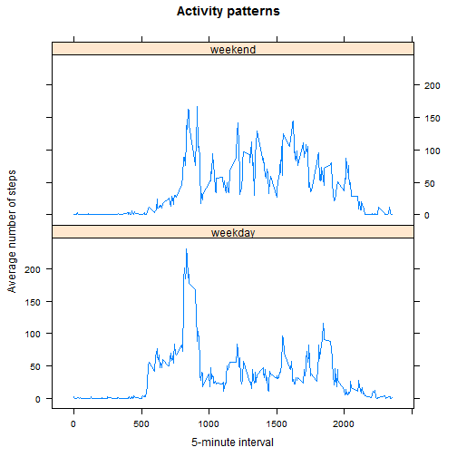

#**Reproducible Research:**
#Peer Assessment 1 
###by eneglia

##Loading data
**1.**Load the data  

```r
data <- read.csv("repdata-data-activity/activity.csv", na.strings="NA")
```
##What is mean total number of steps taken per day?
**1.**Calculate the total number of steps taken per day  
**2.**Make a histogram of the total number of steps taken each day  
**3.**Calculate and report the mean and median of the total number of steps taken per day  

```r
tot_steps<-aggregate(steps ~ date, data = data, sum, na.rm = TRUE)
barplot (height=tot_steps$steps, names.arg=tot_steps$date, las=2, 
        cex.names = 0.5, cex.axis= 0.75,
         main="Steps by day")
```

 

```r
mean(tot_steps$steps)
```

```
## [1] 10766.19
```

```r
median(tot_steps$steps)
```

```
## [1] 10765
```
##What is the average daily activity pattern?
**1.**Make a time series plot (i.e. type = "l") of the 5-minute interval (x-axis) and the average number of steps taken, averaged across all days (y-axis)  
**2.**Which 5-minute interval, on average across all the days in the dataset, contains the maximum number of steps?  

```r
average<-aggregate(steps ~ interval, data = data, mean, na.rm = TRUE)
plot (average$interval, average$steps ,type="l",
      main="Average daily activity pattern",
      ylab="Average number of steps",
      xlab="5-minute interval")
```

 

```r
average[average$steps==max(average$steps),]
```

```
##     interval    steps
## 104      835 206.1698
```
##Imputing missing values
**1.**Calculate and report the total number of missing values in the dataset  
**2.**Devise a strategy for filling in all of the missing values in the dataset  
**3.**Create a new dataset that is equal to the original dataset but with the missing data filled in  
**4.**Make a histogram of the total number of steps taken each day and Calculate and report the mean and median total number of steps taken per day  

```r
sum(is.na(data$steps))
```

```
## [1] 2304
```

```r
colnames(average)=c("interval","interval_average")
imputed<-merge(data,average,by="interval", all.data=TRUE)
imputed<-imputed[order(imputed$date,imputed$interval),]
imputed$steps<-ifelse(is.na(imputed$steps),imputed$interval_average, imputed$steps)
imputed<-imputed[,c(1,2,3)]
tot_steps<-aggregate(steps ~ date, data = imputed, sum, na.rm = TRUE)
barplot (height=tot_steps$steps, names.arg=tot_steps$date, las=2, 
         cex.names = 0.5, cex.axis= 0.75,
         main="Steps by day")
```

 

```r
mean(tot_steps$steps)
```

```
## [1] 10766.19
```

```r
median(tot_steps$steps)
```

```
## [1] 10766.19
```
##Are there differences in activity patterns between weekdays and weekends?
**1.**Create a new factor variable in the dataset with two levels - "weekday" and "weekend"  
**2.**Make a panel plot containing a time series plot (i.e. type = "l") of the 5-minute interval (x-axis) and the average number of steps taken, averaged across all weekday days or weekend days (y-axis)  

```r
imputed$day<-as.factor(weekdays(as.Date(imputed$date)))
imputed$new<-as.factor(ifelse(imputed$day %in% c("sabato","domenica") ,"weekend", "weekday"))
average<-aggregate(steps ~ interval + new, data = imputed, mean, na.rm = TRUE)
library(lattice)
xyplot(average$steps ~ average$interval|average$new, 
        main="Activity patterns",
        xlab="5-minute interval", ylab="Average number of steps",
        layout=c(1,2), type="l")
```

 


